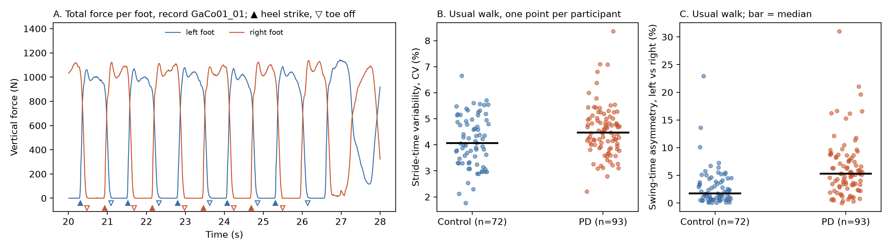

# Section 5. Preliminary Results

_Draft 1, 2026-10-05. PROVISIONAL: the numbers below come from the 237 of 306 recordings (142 of 166 participants) that had downloaded when the draft was written; the demographics table is complete. Every number is re-generated from the full database before the draft is final, and the sentence that says so is updated. The live copy is the shared Google Doc; this file is the snapshot kept with the code. Table 1 is `results/table1_participants.md` (from `scripts/make_table1.py`); Figure 1 is `figures/figure1_events_and_variability.png` (from `scripts/make_figure1.py`, which also writes `results/features_usual_walk.csv` and `results/features_usual_walk_by_group.csv`); the robustness numbers are in `results/event_detection_checks.txt` (from `scripts/check_event_detection.py`)._

We downloaded version 1.0.0 of the database and wrote the loader, gait-event detection and feature code that the three models will share (`src/gaitpdb` in the repository; the scripts named above produce every number, table and figure in this section). A foot is on the ground while its total vertical force exceeds 20 N, heel strike and toe off are the crossings, and stride, stance and swing times follow from them; strides at turns and stops, and the occasional double-length stride from a dragged foot, are removed by duration rules relative to each record's median stride.

Table 1 shows what the dataset actually contains, and three points in it shape the plan. i) The controls are younger than the patients (63.7 vs 66.3 years; 57.9 vs 61.6 in the Si study), although the PhysioNet description gives 66.3 years for both groups, so age has to be reported alongside, or adjusted for in, every model comparison. ii) The patients are at Hoehn and Yahr stage 2 to 3, i.e., established bilateral disease, so whatever accuracy we reach applies to that population and not to the early cases in which clinical diagnosis is weakest [S1]. iii) Participants contribute one to seven recordings, which is why folds must be split by participant rather than by recording.

Figure 1A shows that the event detection does what it should: the markers sit on the rise and fall of the force at each step, and the slow weight transfer at the end of the window (a turn) is excluded. On the usual walk (one recording per participant) the kept strides last 1.10 s on average in both groups, with a swing phase of 35.3% of the stride in the controls and 33.8% in the patients; mean stride time and cadence do not differ, so the patients' slower walking speed in the demographics file (1.04 vs 1.22 m/s) must come from shorter strides, which the insoles cannot measure directly. Figures 1B and 1C compare the two features that the literature singles out: stride-time variability is higher in PD but the distributions overlap heavily (median CV 4.5% vs 4.0%; AUC 0.63, p = 0.014), whereas the swing-time asymmetry between the legs separates the groups considerably better (5.4% vs 1.9%; AUC 0.79, p < 10^-7). The asymmetry difference is not a by-product of the age gap: it does not correlate with age in either group and holds within the 60 to 80 year band (AUC 0.76), whereas stride-time CV rises with age in both groups (Spearman rho about 0.2), which is one more reason to adjust for age.

The research question stands; two things changed in the method. First, the variability feature proved fragile: before the relative stride rule was added, a single double-length stride in a record could double its CV, the group difference was not significant (p = 0.09), and the result swung with the contact threshold (AUC 0.51 at 10 N against 0.71 at 50 N); with the rule in place the CV barely moves between 10 and 50 N (AUC 0.62 to 0.64), and threshold sensitivity is now a standing check in Section 4. Second, asymmetry and swing-phase features move up the list of inputs, and single-feature AUCs will be reported next to the three models so that the value a classifier adds is visible.

The data can support a properly validated estimate of how separable established PD and healthy controls are from timing features alone, within one database and across its three protocols; they cannot support a diagnostic claim, since there are no early-stage or undiagnosed participants, no other movement disorders, and one laboratory's hardware. The largest remaining uncertainty is the heterogeneity between the sub-studies (protocols, recording lengths and ages), which the leave-one-study-out comparison is designed to expose. Before the final submission we need to i) extract the same features from the dual-task and cued walks, ii) run the three classifiers under repeated participant-grouped and leave-one-study-out validation with confidence intervals, and iii) obtain WearGait-PD access (a Synapse account) for the external test if time allows.

**Table 1.** Participants and recordings by sub-study and group. Age and UPDRS motor score are mean ± SD; recordings per participant, recording length and Hoehn and Yahr stage are median (range). _Provisional: the recording counts are from the 237 records downloaded so far; the demographics columns are complete._

| Study               | Group   |   Participants (demographics) |   Participants with recordings |   Recordings | Recordings per participant   | Recording length, s   | Age, years   |   Women, n | Hoehn and Yahr   | UPDRS motor   |
|:--------------------|:--------|------------------------------:|-------------------------------:|-------------:|:-----------------------------|:----------------------|:-------------|-----------:|:-----------------|:--------------|
| Ga: dual task       | PD      |                            29 |                             26 |           54 | 2 (1–3)                      | 121 (121–121)         | 71.1 ± 8.1   |          9 | 2 (2–3)          | 17.9 ± 8.4    |
| Ga: dual task       | Control |                            18 |                             16 |           27 | 2 (1–3)                      | 121 (115–121)         | 71.6 ± 6.7   |          8 |                  |               |
| Ju: auditory cueing | PD      |                            29 |                             27 |           83 | 2 (1–7)                      | 90 (44–264)           | 67.2 ± 9.1   |         13 | 2.5 (2–3)        | 15.8 ± 4.5    |
| Ju: auditory cueing | Control |                            26 |                             19 |           19 | 1 (1–1)                      | 85 (40–115)           | 64.6 ± 6.8   |         14 |                  |               |
| Si: treadmill study | PD      |                            35 |                             28 |           28 | 1 (1–1)                      | 121 (121–121)         | 61.6 ± 8.9   |         13 | 2 (2–2.5)        | 23.7 ± 7.2    |
| Si: treadmill study | Control |                            29 |                             26 |           26 | 1 (1–1)                      | 121 (121–121)         | 57.9 ± 7.0   |         11 |                  |               |
| All                 | PD      |                            93 |                             81 |          165 | 1 (1–7)                      | 121 (44–264)          | 66.3 ± 9.5   |         35 | 2 (2–3)          | 19.3 ± 7.7    |
| All                 | Control |                            73 |                             61 |           72 | 1 (1–3)                      | 121 (40–121)          | 63.7 ± 8.6   |         33 |                  |               |

**Figure 1.** A: total vertical force under each foot in one usual-walk recording (control participant GaCo01), with the detected heel strikes (▲) and toe offs (▽) of the kept strides. B: stride-time variability (coefficient of variation) and C: swing-time asymmetry between the legs, one point per participant on the usual walk, bar at the median.

